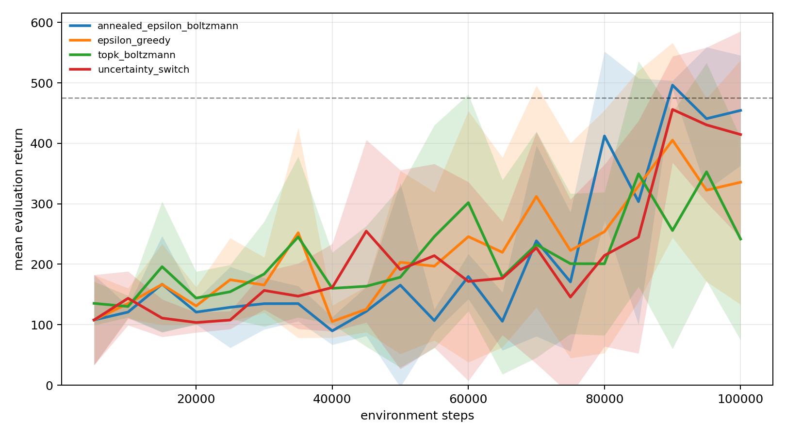
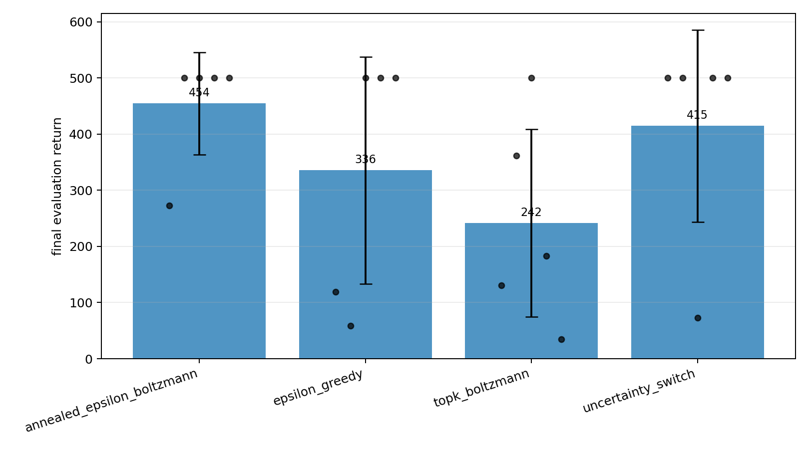
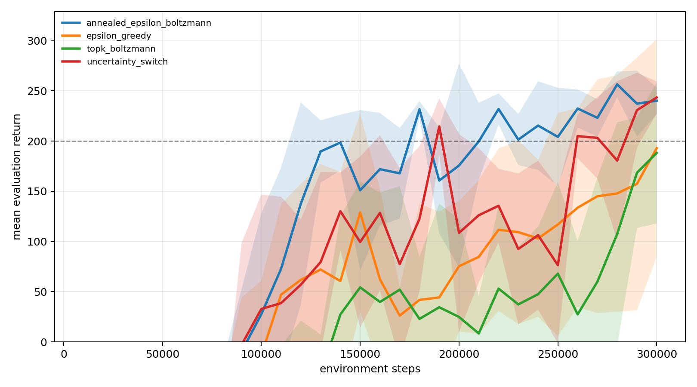
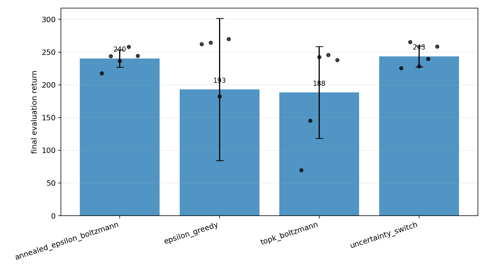
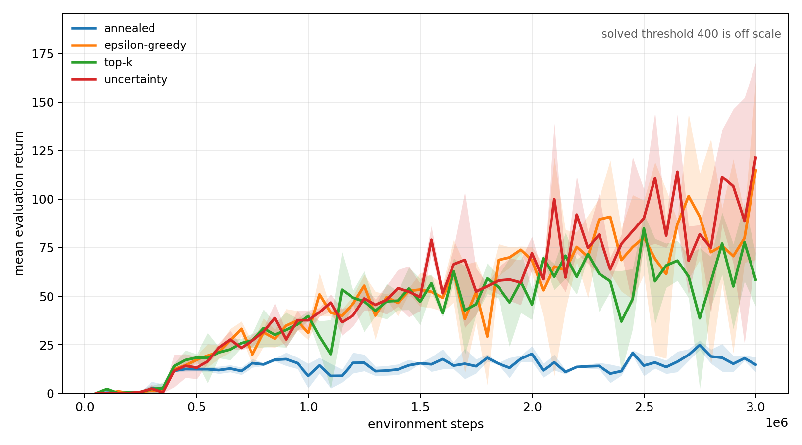
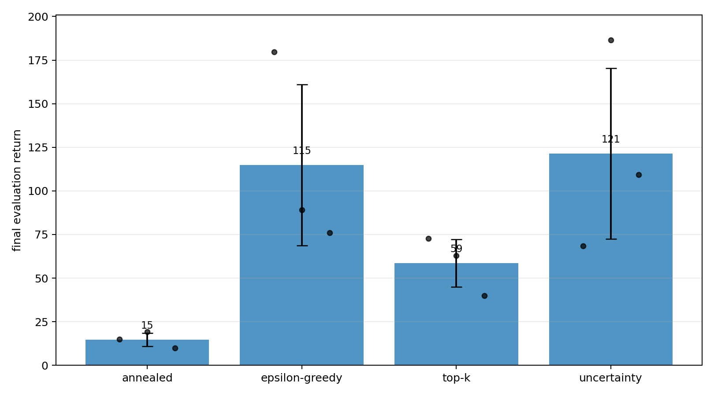

# Epsilon-Greedy to Boltzmann Exploration in DQN

This repository contains a small, reproducible reinforcement learning framework for studying how a Deep Q-Network agent can transition from **epsilon-greedy exploration** to **Boltzmann exploration** during training.

The main idea is simple:

> early in training, Q-values are unreliable, so the agent benefits from robust random exploration; later in training, once the Q-function becomes more informative, the agent can use value-based stochastic exploration through a Boltzmann policy.

The project compares several exploration strategies on classic Gymnasium environments and provides an Atari-ready experimental path.

---

## Project goals

The goal of this project is to investigate whether a DQN agent can benefit from gradually replacing standard epsilon-greedy exploration with Boltzmann-style action sampling.

In standard DQN, epsilon-greedy exploration selects the greedy action most of the time and a random action with probability ε. This is simple and robust, especially early in training. However, it treats all non-greedy actions equally during random exploration.

Boltzmann exploration, on the other hand, samples actions according to a softmax distribution over Q-values. This allows the agent to prefer actions that currently look better while still maintaining stochasticity. The downside is that it depends strongly on the scale and reliability of Q-values.

This repository explores hybrid strategies that try to combine the strengths of both methods.

---

## Implemented exploration strategies

The project implements several discrete-action exploration policies:

| Strategy | Name in config | Description |
|---|---|---|
| Epsilon-greedy | `epsilon_greedy` | Standard DQN baseline with a linear epsilon schedule. |
| Boltzmann | `boltzmann` | Samples actions from a softmax distribution over Q-values. |
| Annealed epsilon-to-Boltzmann | `annealed_epsilon_boltzmann` | Smoothly transitions from epsilon-greedy to Boltzmann exploration. |
| Top-k Boltzmann | `topk_boltzmann` | Uses epsilon exploration and then samples only among the top-k Q-value actions. |
| Uncertainty-aware switch | `uncertainty_switch` | Switches toward Boltzmann exploration when the schedule has progressed and Q-value entropy is low. |

The main experimental comparison is between these exploration rules while keeping the DQN training pipeline fixed.

---

## DQN features

The implementation includes a standard DQN training setup with several practical improvements:

- replay buffer with random mini-batch sampling,
- target Q-network,
- optional soft target updates,
- Double DQN target selection,
- Huber loss,
- gradient clipping,
- MLP Q-network for vector observations,
- CNN Q-network for image observations,
- support for Gymnasium environments,
- correct distinction between `terminated` and `truncated` transitions,
- CSV logging,
- periodic evaluation,
- checkpoint saving,
- plotting and multi-run analysis utilities.

---

## Repository structure

```text
.
├── configs/                # YAML experiment configurations
│   ├── cartpole/           # CartPole experiments
│   ├── lunarlander/        # LunarLander experiments
│   └── atari/              # Atari / Breakout configuration path
│
├── src/egtb/               # Main Python package
│   ├── agents/             # DQN agent components
│   ├── exploration/        # Exploration strategies
│   ├── networks/           # MLP and CNN Q-networks
│   ├── replay/             # Replay buffer
│   ├── training/           # Training loop
│   └── analysis/           # Plotting and result aggregation
│
├── figures/                # Example result plots
├── tests/                  # Unit and smoke tests
├── docs/                   # Additional documentation
├── cluster_manifests/      # Cluster-related execution files
├── scripts/                # Utility scripts
├── pyproject.toml          # Project metadata and dependencies
└── README.md
```

---

## Installation

Create and activate a virtual environment:

```bash
python3 -m venv .venv
source .venv/bin/activate
```

Install the project in editable mode:

```bash
pip install -e ".[classic,dev,plots]"
```

For LunarLander experiments, install Box2D dependencies:

```bash
pip install -e ".[box2d]"
```

For Atari experiments:

```bash
pip install -e ".[atari,plots]"
```

Atari environments require ROM installation and license acceptance through Gymnasium/ALE tooling.

---

## Running experiments

### CartPole

Run the epsilon-greedy baseline:

```bash
egtb-train --config configs/cartpole/epsilon_greedy.yaml
```

Run the annealed epsilon-to-Boltzmann strategy:

```bash
egtb-train --config configs/cartpole/annealed_boltzmann.yaml
```

Run top-k Boltzmann exploration:

```bash
egtb-train --config configs/cartpole/topk_boltzmann.yaml
```

Run the uncertainty-aware switching strategy:

```bash
egtb-train --config configs/cartpole/uncertainty_switch.yaml
```

### LunarLander

```bash
egtb-train --config configs/lunarlander/annealed_boltzmann.yaml
egtb-train --config configs/lunarlander/topk_boltzmann.yaml
```

### Atari / Breakout

```bash
egtb-train --config configs/atari/breakout_annealed.yaml
```

The Atari configuration is intended as a scalable experiment path. Reliable Atari results usually require substantially longer training and more random seeds than the smaller control tasks.

---

## Useful CLI overrides

Configuration values can be overridden from the command line. For example:

```bash
egtb-train \
  --config configs/cartpole/annealed_boltzmann.yaml \
  --total-steps 10000 \
  --seed 3 \
  --device cpu \
  --output-dir runs/cartpole_debug
```

This is useful for short debugging runs before launching longer experiments.

---

## Outputs

Each training run creates a timestamped directory under `runs/`.

A typical run directory contains:

```text
runs/<run-name>/
├── config.yaml      # Resolved configuration used for the run
├── train.csv        # Training episode logs
├── eval.csv         # Periodic evaluation results
├── summary.json     # Final metrics and metadata
└── agent.pt         # Saved PyTorch checkpoint
```

The most important evaluation file is `eval.csv`, because it measures the quality of the learned policy under evaluation conditions. Training returns can be harder to interpret because they are directly affected by the exploration policy.

---

## Plotting and analysis

Plot one or more individual runs:

```bash
egtb-plot runs/<run-a> runs/<run-b> --output runs/comparison.png
```

Aggregate multiple runs by strategy:

```bash
egtb-analyze runs/cartpole_100k --output-dir runs/cartpole_100k_analysis
```

The analysis script produces grouped learning curves, final-return plots, and CSV summaries.

---

## Example results

The repository includes example figures comparing the implemented exploration strategies.

### CartPole

CartPole is a fast control task used to validate that the DQN pipeline and exploration policies work correctly.





### LunarLander

LunarLander is more difficult than CartPole and gives a more informative comparison between exploration strategies.





### Breakout

Breakout demonstrates the Atari-ready path with image observations and a convolutional Q-network.





---

## Testing

Run the test suite with:

```bash
python3 -m pytest
```

A short smoke run can be used to check that environment stepping, replay sampling, optimization, checkpointing, and evaluation work correctly:

```bash
egtb-train \
  --config configs/cartpole/annealed_boltzmann.yaml \
  --total-steps 300 \
  --learning-starts 64 \
  --eval-interval 0 \
  --eval-episodes 2 \
  --log-interval 100 \
  --device cpu \
  --output-dir runs/smoke
```

---

## Suggested experimental protocol

Our experimental workflow is:

1. Start with CartPole to validate implementation changes quickly.
2. Run each exploration strategy with several random seeds.
3. Compare evaluation curves, not only training returns.
4. Move to LunarLander for a more demanding low-dimensional benchmark.
5. Use the Atari configuration only after the smaller environments are stable.

For fair comparison, all strategies are to be evaluated under the same total training steps, seeds, network architecture, optimizer settings, and evaluation protocol.

---

## Interpretation

The experiments are designed to test the following hypothesis:

> epsilon-greedy exploration is safer early in training, while Boltzmann exploration can become more useful later, once Q-values contain meaningful action preferences.

The annealed and uncertainty-aware strategies implement this hypothesis directly. They avoid relying too strongly on Q-values at the beginning of training, while allowing the policy to become more value-sensitive later.

However, Boltzmann exploration is sensitive to Q-value scale and temperature scheduling. This means that performance depends not only on the exploration rule itself, but also on the stability and calibration of the learned Q-function.

---

## References

This project is based on standard ideas from value-based deep reinforcement learning:

- Mnih et al., *Human-level control through deep reinforcement learning*, Nature, 2015.
- van Hasselt, Guez, and Silver, *Deep Reinforcement Learning with Double Q-learning*, AAAI, 2016.
- Sutton and Barto, *Reinforcement Learning: An Introduction*, 2nd edition, 2018.

---


---

## Author

Stanisław Pańkowski, Filip Baciak
